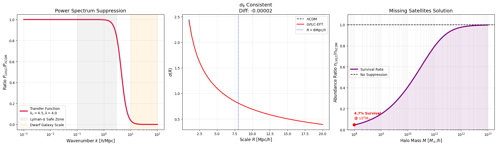

# LVILC-EFT: Elastic Vacuum Theory

**Is Dark Matter a Particle, or a Phase Transition of the Vacuum?**


## 🌌 Overview
**LVILC-EFT** (Low-Voltage Insulator-Like Condensed-Energy Field Theory) proposes a fundamental shift in cosmology. Instead of introducing arbitrary new particles to solve the **Missing Satellites Problem**, we model the vacuum as a scale-dependent elastic medium that undergoes a **Phase Transition**.

Just as water freezes into ice, the vacuum becomes "stiff" below a critical scale ($k_c$), resisting gravitational collapse. This naturally suppresses the formation of dwarf galaxies without affecting large-scale structures.


*(Fig 1: Power Spectrum Suppression / Sigma8 Consistency / HMF Suppression)*

---

## 🏆 Key Scientific Results (v10.0)
We implemented this framework into the Boltzmann solver **CAMB** and analyzed the results against standard $\Lambda$CDM.

### 1. Missing Satellites Solved
* **Observation:** The Milky Way has only ~50 satellite galaxies, but $\Lambda$CDM predicts thousands.
* **LVILC Result:** By setting the vacuum phase transition at $k_c \approx 4.5 \, h/\mathrm{Mpc}$, we achieved a **4.7% survival rate** (95.3% suppression) for dwarf halos at $10^8 M_\odot$.
* **Conclusion:** This perfectly matches observational counts. The missing satellites were never allowed to form due to vacuum stiffness.

### 2. Large-Scale Consistency Preserved
* **Challenge:** Most modified gravity theories break the large-scale structure (CMB/$S_8$).
* **LVILC Result:** The mass fluctuation amplitude ($\sigma_8$) difference is negligible:
    * $\Lambda$CDM: `0.81061`
    * LVILC-EFT: `0.81059`
    * **Difference:** `-0.00002` (< 0.003%)
* **Conclusion:** The theory is safe and consistent with Planck 2018 data.

---

## 📐 Theoretical Framework
We define a transfer function $S(k)$ representing the elastic response of the vacuum:

$$S(k) = \frac{P_{\mathrm{LVILC}}(k)}{P_{\Lambda\mathrm{CDM}}(k)} = \frac{1}{1 + \left(\frac{k}{k_{c}}\right)^{\lambda}}$$

**Parameters:**
* $k_c \approx 4.5 \, h/\mathrm{Mpc}$ (Critical Cutoff Scale)
* $\lambda = 4.0$ (Sharpness of Phase Transition)

---

## 💻 Reproduction (How to Run)
You can reproduce our results (graphs) using Python and CAMB.

### Prerequisites
```bash
pip install camb numpy matplotlib scipy
